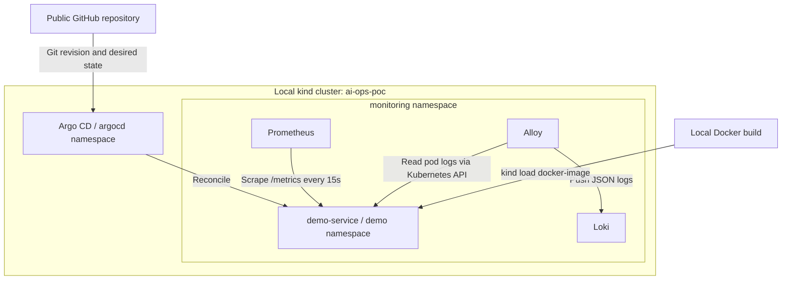

# Local Kubernetes GitOps and observability demo

A small, disposable infrastructure foundation for incident analysis. This iteration contains infrastructure and an HTTP service only.

## Architecture



One control-plane node; no ingress, operators, Grafana UI, or external storage. Prometheus and Loki use ephemeral disk: pod recreation can lose their history. Recreating the cluster removes all state.

## Prerequisites

Install these yourself on macOS or Linux:

- Docker Desktop or Docker Engine, running, with approximately 4 CPUs and 6 GB RAM available (8 GB recommended).
- kind **0.27.0 or newer** for the selected Kubernetes node image.
- kubectl compatible with Kubernetes 1.32 (1.31–1.33), Helm 3.17+, GNU/BSD make.
- Bash 3.2+, Python 3.9+, curl, Git, and ordinary Unix tools.
- Internet access to GitHub, chart repositories, PyPI, and container registries during installation. No registry push or cloud account is needed.

## Quick start

**Publish these files to a public GitHub repository first.** Argo CD reads GitHub, not your local checkout. For a new repository, commit and push the complete generated tree to `main` before setup. If cloning an existing published copy:

```bash
git clone https://github.com/<user>/<repo>.git
cd <repo>
export GIT_REPO_URL=https://github.com/<user>/<repo>.git
# Optional: export GIT_REVISION=your-branch  # default: main
make up
```

`make up` checks the repository configuration, creates/reuses the cluster, builds and loads the image, installs infrastructure, creates the Argo CD Application, waits up to ten minutes for `Synced/Healthy`, then verifies observability. Re-running it is safe in normal use. Everything targets `kind-ai-ops-poc` explicitly, regardless of your current kubectl context.

For individual steps:

```bash
make cluster
make build-image
make install
make bootstrap
make verify
make status
```

Only the Application resource is submitted by bootstrap. **Argo CD deploys the service** from `gitops/demo-service/overlays/local`; the scripts never apply its Deployment directly.

## Components and selected versions

Pins are in `versions.env`; the app's base image and dependency are pinned in its Dockerfile and requirements file. Chart versions also pin their default component images. These are reproducible demo pins, not a promise of current security support; review upgrades before exposing the environment beyond localhost.

| Component | Chart version | Main image/version |
| --- | --- | --- |
| kind Kubernetes node | — | kindest/node:v1.32.2 |
| Argo CD | argo-cd 7.8.23 | v2.14.9; Redis 7.4.2-alpine |
| Prometheus | prometheus 27.5.0 | v3.2.0 |
| Loki | loki 6.29.0 | 3.4.2 |
| Grafana Alloy | alloy 0.12.5 | v1.7.4 |
| demo-service | — | demo-service:0.1.0; Python 3.12.9-slim-bookworm |
| Python metrics library | — | prometheus-client 0.21.1 |

kind runs the local Kubernetes API and workloads. Argo CD watches the public repository and reconciles the demo. Prometheus is a single server with a six-hour retention window and only one scrape job. Loki is a single binary using filesystem storage with 24-hour retention. Alloy is Grafana's supported log collector and reads only pods in `demo`, using a namespaced Role; it needs no host log mounts or privileged container. The Python service runs as a non-root user with a read-only filesystem and no service-account token.

Argo CD and Helm generate operational Secrets (including the initial Argo admin password). No credentials are committed and the demo application needs no Secrets. The Kubernetes control-plane node uses kind's required Docker privileges; application containers are not privileged.

## GitOps flow

GitHub → Argo CD Application → Kustomize local overlay → `demo` namespace. `GIT_REPO_URL` and `GIT_REVISION` configure the Application through `scripts/bootstrap.sh`. Application revision and sync history remain available in standard Argo CD status:

```bash
kubectl --context kind-ai-ops-poc -n argocd get application demo-service -o yaml
```

Commit and push manifest changes to the configured branch. Argo CD polls Git (normally about three minutes, plus jitter); automated sync, pruning, and self-healing are enabled. To request an immediate refresh, run `make reconcile-demo`.

Demonstrate recovery:

```bash
kubectl --context kind-ai-ops-poc -n demo delete deployment demo-service
make reconcile-demo
# Allow Argo CD to recreate it, then:
make verify
```

A missing Deployment may briefly make `rollout status` fail; wait for the resource to reappear before verification. Reset desired configuration by reverting the Git change and pushing it. To reset everything, run `make destroy && make up`.

For source changes, rebuild/load with `make build-image`, then `make restart-demo`. Reusing the same local tag requires a restart because running pods keep their image. For repeatable Git-correlated releases, choose a new tag, update both `DEMO_IMAGE` in `versions.env` and the GitOps Deployment image, build/load it, and commit/push the manifest. The local image uses `imagePullPolicy: Never` and is never pushed to a registry.

## Observability

`GET /` returns service/version JSON; `/health` and `/ready` return HTTP 200. `/metrics` exposes standard Prometheus counters and histograms: `http_requests_total` and `http_request_duration_seconds`. Labels include `service`, `method`, bounded `path`, and `status`; unknown paths share `other`. Query strings never become labels. Probes create request metrics and logs even without interactive traffic.

Prometheus scrapes the internal Service DNS name every 15 seconds. Examples:

```promql
up{job="demo-service"}
http_requests_total{service="demo-service",status="200"}
rate(http_request_duration_seconds_sum{service="demo-service"}[5m])
```

Requests log JSON to stdout with UTC timestamp, level, service, version, method, bounded path, status, and duration in seconds. Alloy forwards the logs to Loki with `namespace`, `service`, `pod`, and `container` labels. JSON fields remain log content, avoiding unnecessary indexed labels. Example LogQL:

```logql
{namespace="demo",service="demo-service"} | json
```

Use `make loki-api`, then:

```bash
curl -fsS -G http://localhost:3100/loki/api/v1/query_range \
  --data-urlencode 'query={namespace="demo",service="demo-service"} | json' \
  --data-urlencode 'since=10m'
```

The verification script checks actual successful scrapes, emitted request counters, and queryable `/health` logs. It uses temporary localhost port-forwards and cleans them up.

The existing Git revision, Deployment/ReplicaSet metadata, labels, versioned logs, and request metrics support future correlation. A later iteration can add `BACKEND_URL` behavior to the service and an environment variable to the Deployment: changing it in Git will create a ReplicaSet and can produce HTTP 500 metrics and ERROR logs. No backend dependency, incident switch, incident automation, or AI functionality exists in this iteration.

## Useful commands and access

Port-forward commands run in the foreground; use separate terminals and Ctrl-C to stop them. They bind only to localhost.

| Command | Purpose / URL |
| --- | --- |
| `make up` | Complete setup and verification |
| `make cluster` | Create or reuse kind cluster |
| `make build-image` | Build and load local image into existing cluster |
| `make install` | Install/update pinned infrastructure charts |
| `make bootstrap` | Configure Application and wait for GitOps sync |
| `make verify` | Check mandatory runtime and observability evidence |
| `make status` | List all pods and Argo applications |
| `make argocd-ui` | https://localhost:8443 |
| `make argocd-password` | Print generated initial password; username `admin` |
| `make prometheus-ui` | http://localhost:9090 |
| `make demo-service` | http://localhost:8080 |
| `make loki-api` | http://localhost:3100 |
| `make reconcile-demo` | Ask Argo CD to refresh Git immediately |
| `make restart-demo` | Restart pods after rebuilding the same local image tag |
| `make destroy` | Delete only `ai-ops-poc` |

Argo CD uses its chart-generated self-signed HTTPS certificate. For browser access, inspect and trust the local certificate as appropriate for your machine. Scripts do not disable TLS verification. `make argocd-password` retrieves a generated credential from your local cluster; do not commit its output.

```bash
make demo-service
# In another terminal:
curl -f http://localhost:8080/health
curl -f http://localhost:8080/metrics
```

## Troubleshooting

- **Docker not running:** start Docker Desktop/Engine; confirm `docker info` works. Host prerequisites are never installed by scripts.
- **Old kind:** update to 0.27.0+ before creating the Kubernetes 1.32 node. Check available Docker memory/disk if nodes or pods cannot start.
- **Cluster already exists:** `make cluster` reuses it; configuration changes require `make destroy` followed by recreation.
- **Local image missing / ErrImageNeverPull:** run `make build-image` for this cluster. Ensure Git's image tag matches `DEMO_IMAGE`. Then `make restart-demo` if necessary.
- **Wrong repository URL / revision:** export the correct public `GIT_REPO_URL` and `GIT_REVISION`, push the files, then `make bootstrap`. Inspect Application `.status.conditions` and repo-server logs. Local uncommitted edits are invisible to Argo CD.
- **Application OutOfSync:** inspect `kubectl --context kind-ai-ops-poc -n argocd get application demo-service -o yaml`; check controller logs, Git contents, and image availability. Try `make reconcile-demo`. Do not manually apply the service manifests.
- **Prometheus not scraping:** inspect http://localhost:9090/targets after `make prometheus-ui`; check `demo-service` Service endpoints, pod readiness, `/metrics`, and the installed ConfigMap. Allow at least one 15-second scrape interval.
- **Loki not receiving logs:** check `kubectl --context kind-ai-ops-poc -n monitoring logs deployment/alloy` and `logs statefulset/loki`; inspect the `alloy-pod-logs` Role/RoleBinding in `demo`. Generate a `/health` request, allow delivery, and use the namespace/service query above. Restarted ephemeral Loki loses old logs.
- **Port already allocated:** stop another port-forward or choose a different local port. Verification allocates free ports automatically.
- **Helm timeout / Pending / OOMKilled:** inspect pod events and Docker resource limits; increase Docker memory and rerun `make install`. Helm downloads and first image pulls can take several minutes.

## Cleanup

```bash
make destroy
```

This deletes the cluster and its observability data without touching other kind clusters, the GitHub repository, host tools, or Docker's cached images. Run `make up` to recreate it.
